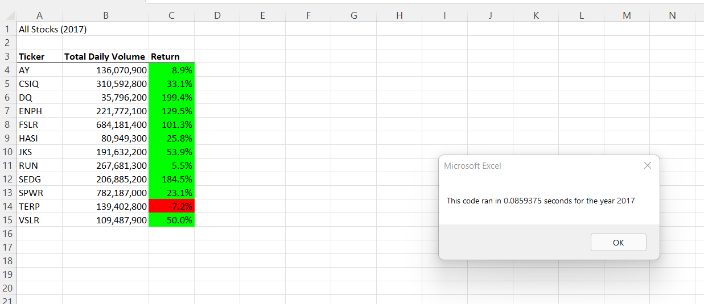
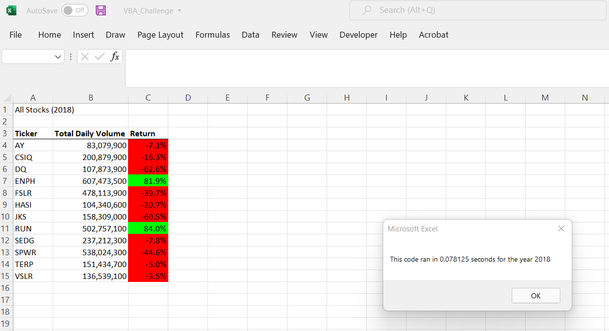

# Stock Analysis

## Project Overview
Steve, a recent finance major graduate has been commissioned by his parents (his first clients) to manage their portfolio. Although Steve’s parents have not conducted much research on the matter, they are interested in capitalizing on alternative energy companies. For sentimental reasons, Steve’s parents are drawn to investing all their funds in DAQO New Energy Corp stocks. Steve, however, is more concerned with ensuring that his parents’ portfolio is diversified, and therefore would like to analyze multiple green energy stocks in addition to DAQO New Energy Corp (“DQ”). While completing this project, I analyzed various stock data contained on an Excel file provided by Steve himself. Using VBA, I’ve created code to automate the analyzation of the stocks in question. This code will also enable Steve to reuse it with any stock and reduce the occurrence of errors.

### Results

The screenshot above displays the returns for green energy stocks which Steve wanted to analyze. At 129.5%, DQ stock is clearly a front runner for maximizing one’s returns.

However, this screenshot (directly above); gives us a much different picture of the same stocks’ performances for the year 2018. Careful analysis would lead one to invest funds in ENPH stock with an 81.9% return, as opposed to DQ stock which suffered a 62.6% loss. One can also determine based on these two analyses, that RUN stock which showed a 5.5% return in 2017 and an 84% return in 2018 is a conservatively safe stock to invest in.

### Summary		
1.	The advantages of refactoring the code are that not only is it a much cleaner and simpler code, which is easier to read through. It also takes less time to run.
I would, however, say that refactoring codes has the disadvantage of requiring more acuity and concentration. I found that it was important to remain focused on the task at hand in order to prevent minute errors (syntax and spacing) which had not occurred on the original code.
2.	I must reiterate (no “coding” pun intended) the advantages and disadvantages of refactoring code and compare those to the pros and cons of using the original VBA script. The disadvantages of the original VBA script are that it is longer, messier in that it contains nested loops, and takes a longer timeframe to run. However, the original VBA script’s advantage is that it is much more detailed in comments or steps taken during the coding process.
